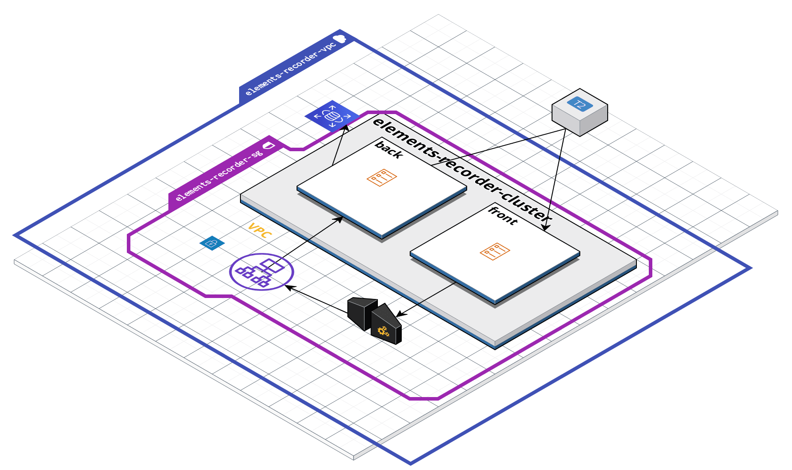

# Installation

You'll need JDK 17 to run this project. You can install a working JDK with sdkman. The version that has been used for development 
is the `17.0.2.8.1-amzn`.

To ensure everything's working properly, run
* `./mvnw clean install`
* `./mvnw test`

# Infrastructure


The front and the back of this application run inside containers. Docker images are pushed to ECR and task definitions 
retrieve them. 
The backend app is exposed on port 8088 and is reached through a load balancer. The backend is not internet facing.
The frontend app is exposed on port 80 and is accessible through internet. 
A request goes through the following layers:
* client hits EC2 instance's IP and sees the web app
* the web app performs a request to the API Gateway. API Gateway is internet facing.
* API Gateway forwards the request to the ALB thanks to a VPC private link. The VPC private link allows the API gateway 
to forward request to the ALB as it is not internet facing and only exposes port 8087. A security group rule ensure the 
ALB can only be hit by the API gateway.
* ALB forwards request to backend

# How to run
Locally, you can simply run the backend with a database:
`docker-compose --file docker-compose-local.yml up --build [--force-recreate --no-deps]`

# Docker troubleshooting
If you consistently see that your changes are not reported to your containers, consider deleting all the images and run the following command 
```
docker-compose up --build --force-recreate
```

# Access local db
* `sudo -u postgres -i`
* `\l` to list databases
* Don't forget the `;` at the end of your queries!!

# Features to add
* Rating should have a maximum
* Expired JWT should not throw any exception
...
# Bugs to fix 
* Timestamps for dates aren't set on adding and updating

# Things that I'd like to have on this project
* CI/CD including
    * automated deployment on AWS
    * good integration tests with Docker
* Gradle as a build tool
* Fancy badges on Github repo